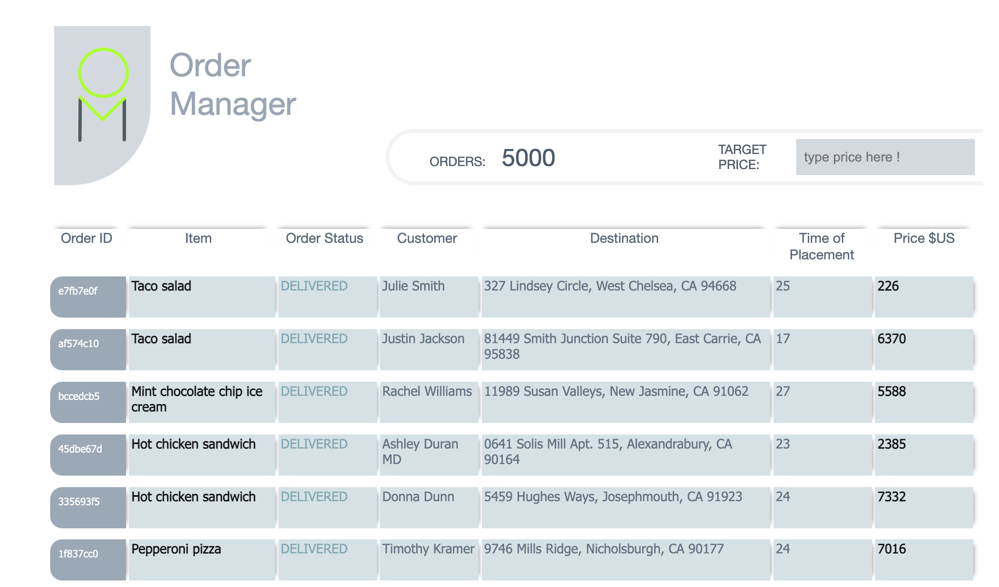

# Order Manager Application Setup Guide !

This small guide will help you run the Order Manager application. 


## Prerequisites

- Node.js
- npm (Node Package Manager)

## Installation Steps

1. **Install Dependencies**

   ```bash
   npm install

1. **Run webpack Dev Server**
This script runs webpack-dev-server along with nodemon for changes.
   ```bash
   npm run webpack:dev


### Thank you looking into this !!!
